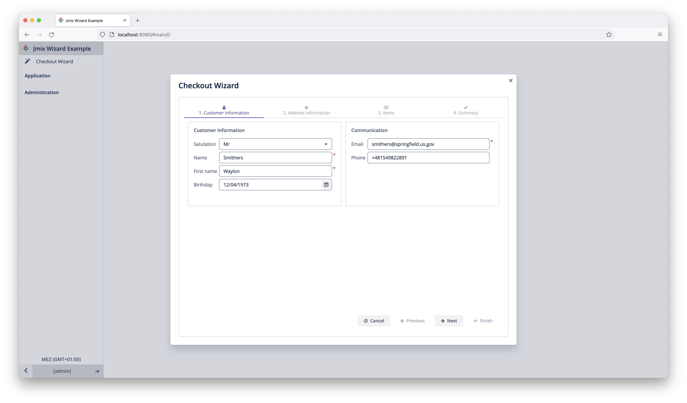
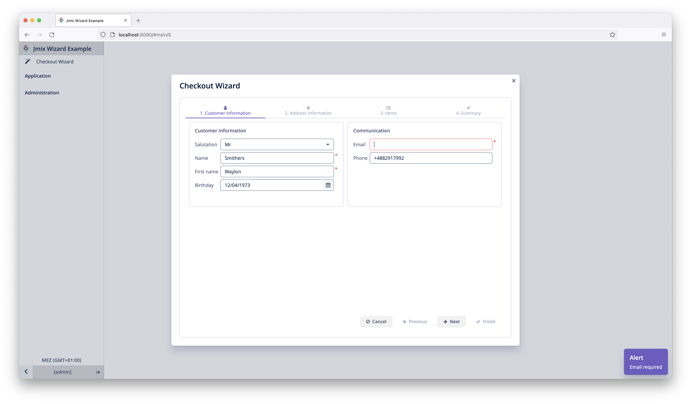
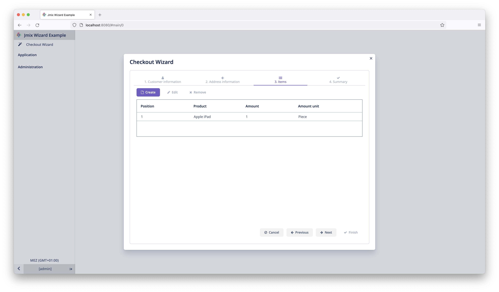
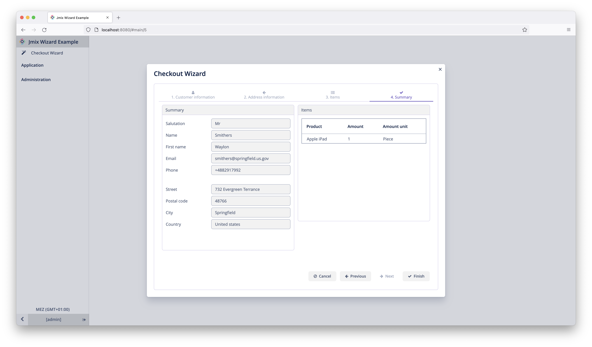

[](http://www.apache.org/licenses/LICENSE-2.0) 


[](https://github.com/mariodavid/jmix-wizard/releases/)
[](https://github.com/mariodavid/jmix-wizard-example)
[](https://www.jmix.io/marketplace/wizard)


# Jmix Wizard

This addon lets you create UI wizards through a specific UI component.




A UI wizard should be used in case of:

* multi step input
* complex decision workflows
* the user needs to be guided through the process


For more information on this topic see: http://ui-patterns.com/patterns/Wizard


## Installation


Add the dependency to your project:

```groovy
dependencies {
  implementation 'de.diedavids.jmix:jmix-wizard-starter:*addon-version*'
}
```

## Using the addon

Add the XML namespace `wizard` to the window tag of your screen like this:

```xml
    <window xmlns="http://jmix.io/schema/ui/window"
            xmlns:wizard="http://schemas.diedavids.de/wizard/1.0/wizard-component.xsd">
```

Then add your wizard component to the screen:

```xml
<wizard:wizard id="wizard">
    <wizard:tab
      id="step1Tab"
      caption="msg://step1"
      icon="font-icon:ADN"
      spacing="true"
      margin="true">
        <button id="checkBtn" icon="font-icon:CHECK" />
    </wizard:tab>
    <wizard:tab
      id="step2Tab"
      caption="msg://step2"
      icon="font-icon:ADN">
        <button id="check2Btn" icon="font-icon:CHECK" />
    </wizard:tab>
</wizard:wizard>
```

The Wizard as well as its Tabs have the same attributes available as the ones from the `TabSheet` component of Jmix, as the Wizard component is just a specialized version of the `TabSheet`  component.

The Wizard has particular subscription methods, that can be used in order to programmatically interact with
the Wizard component. Here is an example of those:

```java
@UiController("ddcw_SimpleWizard")
@UiDescriptor("simple-wizard.xml")
public class WizardTestScreen extends Screen {

    @Inject
    protected Wizard wizard;
    @Inject
    protected Notifications notifications;

    @Subscribe("wizard")
    protected void onCancelWizardClick(
        WizardCancelClickEvent event
    ) {
        
        notifications.create(NotificationType.TRAY)
            .withCaption("Wizard cancelled")
            .show();
    }

    @Subscribe("wizard")
    protected void onWizardStepPreChangeEvent(
        WizardTabPreChangeEvent event
    ) {

        notifications.create(NotificationType.TRAY)
            .withCaption("Tab will be changed unless `event.preventTabChange();` is called in here")
            .show();
    }

    @Subscribe("wizard")
    protected void onWizardStepChangeEvent(
        WizardTabChangeEvent event
    ) {
        notifications.create(NotificationType.TRAY)
            .withCaption("Tab has changed")
            .show();
    }

    @Subscribe("wizard")
    protected void onFinishWizardClick(
        WizardFinishClickEvent event
    ) {

        notifications.create(NotificationType.TRAY)
            .withCaption("Wizard finished")
            .show();
    }

}
```


### Example usage
To see this addon in action, check out this example: [jmix-wizard-example](https://github.com/mariodavid/jmix-wizard-example).

#### Example: Checkout Wizard








